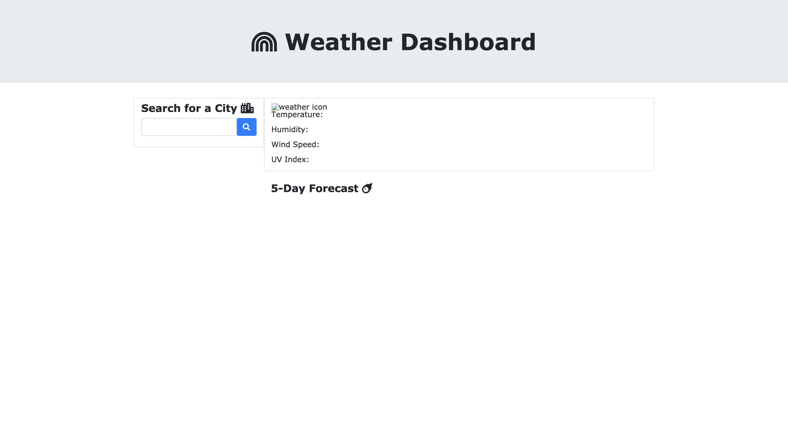

# Weather-Dashboard

# Description

Weather dashboard application that tells the user the current weather and a five-day forecast for a city. 

Users type their desired city into the text field and click the search button. The application makes a request to OpenWeather's Current Weather Data, One Call, and 5 day/3 hour forecast APIs to gather the date, the searched city's current conditions in the form of an icon, the temperature, the humidity, and the UV Index, as well as the conditions, temperature, and humidity for the next 5 days. The UV Index changes color depending on the risk of harm from unprotected sun exposure. Previously searched cities appear under the text field in a history section. 

# Mock Up

Before City Search:

City Search

## Technologies Used

* HTML
* CSS
* JavaScript
* jQuery
* BootStrap

## Links

* GitHub: https://github.com/jkcanoy/Weather-Dashboard

* Live Page: https://jkcanoy.github.io/Weather-Dashboard/

